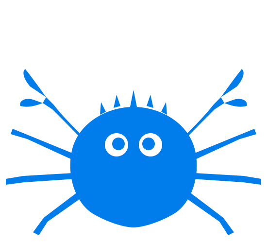

<p align="center">
  
</p>

<h1 align="center">ClawPlus</h1>

<p align="center">
  <strong>The Desktop Interface for OpenClaw AI Agents</strong>
</p>

<p align="center">
  <a href="#features">Features</a> •
  <a href="#why-clawx">Why ClawPlus</a> •
  <a href="#getting-started">Getting Started</a> •
  <a href="#portable-usb-mode">Portable USB</a> •
  <a href="#architecture">Architecture</a> •
  <a href="#development">Development</a> •
  <a href="#contributing">Contributing</a>
</p>

<p align="center">
  
  
  
  <a href="https://discord.com/invite/84Kex3GGAh" target="_blank">
  
  </a>
  
  
</p>

<p align="center">
  English | <a href="README.zh-CN.md">简体中文</a> | <a href="README.ja-JP.md">日本語</a>
</p>

---

## Overview

**ClawPlus** bridges the gap between powerful AI agents and everyday users. Built on top of [OpenClaw](https://github.com/OpenClaw), it transforms command-line AI orchestration into an accessible, beautiful desktop experience—no terminal required.

Whether you're automating workflows, managing AI-powered channels, or scheduling intelligent tasks, ClawPlus provides the interface you need to harness AI agents effectively.

ClawPlus comes pre-configured with best-practice model providers and natively supports Windows as well as multi-language settings. Of course, you can also fine-tune advanced configurations via **Settings → Advanced → Developer Mode**.

---

## Screenshot

<p align="center">
  
</p>

<p align="center">
  
</p>

<p align="center">
  
</p>

<!-- <p align="center">
  
</p> -->

<p align="center">
  
</p>

<p align="center">
  
</p>

---

## Why ClawPlus

Building AI agents shouldn't require mastering the command line. ClawPlus was designed with a simple philosophy: **powerful technology deserves an interface that respects your time.**

| Challenge                 | ClawPlus Solution                               |
| ------------------------- | ----------------------------------------------- |
| Complex CLI setup         | One-click installation with guided setup wizard |
| Configuration files       | Visual settings with real-time validation       |
| Process management        | Automatic gateway lifecycle management          |
| Multiple AI providers     | Unified provider configuration panel            |
| Skill/plugin installation | Built-in skill marketplace and management       |

### OpenClaw Inside

ClawPlus is built directly upon the official **OpenClaw** core. Instead of requiring a separate installation, we embed the runtime within the application to provide a seamless "battery-included" experience.

We are committed to maintaining strict alignment with the upstream OpenClaw project, ensuring that you always have access to the latest capabilities, stability improvements, and ecosystem compatibility provided by the official releases.

---

## Features

### 🎯 Zero Configuration Barrier

Complete the entire setup—from installation to your first AI interaction—through an intuitive graphical interface. No terminal commands, no YAML files, no environment variable hunting.

### 💬 Intelligent Chat Interface

Communicate with AI agents through a modern chat experience. Support for multiple conversation contexts, message history, and rich content rendering with Markdown.

### 🤖 Multi-Agent Management

Create, configure, and switch between multiple AI agents—each with its own model, skills, and SOUL.md personality definition. Supports a **company-style hierarchy** with lead/sub roles, visualized as an interactive **org-chart**. Manage agent names, tool permissions, **per-agent skill allowlists**, and channel bindings through a sleek **glassmorphism settings dialog**. Quickly spin up preconfigured agents from **built-in templates** (Coding, Research, Writing, DevOps, Data, Creative) or **import** full agent configurations. Assign specific agents to channels and cron tasks for fine-grained control.

### 📡 Multi-Channel Management

Configure and monitor multiple AI channels simultaneously. Run **multiple bot accounts** of the same channel type (e.g. two Telegram bots for different agents). Telegram group IDs are auto-detected and configured with per-group **@mention** permissions. Each channel operates independently with dedicated agent bindings.

### ⏰ Cron-Based Automation

Schedule AI tasks to run automatically. Define triggers, set intervals, and **assign specific agents** to each scheduled task. Let your AI agents work around the clock without manual intervention.

### 🧩 Extensible Skill System

Extend your AI agents with pre-built skills. Browse, install, and manage skills through the integrated skill panel—no package managers required.

### 🔐 Secure Provider Integration

Connect to multiple AI providers (OpenAI, Anthropic, Google, Moonshot, MiniMax, and more) with credentials stored securely in your system's native keychain. Supports **browser-based OAuth** for OpenAI alongside traditional API key authentication.

### 🌙 Adaptive Theming

Light mode, dark mode, or system-synchronized themes. ClawPlus adapts to your preferences automatically.

---

## Getting Started

### System Requirements

- **Operating System**: macOS 11+, Windows 10+, or Linux (Ubuntu 20.04+)
- **Memory**: 4GB RAM minimum (8GB recommended)
- **Storage**: 1GB available disk space

### Installation

#### Pre-built Releases (Recommended)

Download the latest release for your platform from the [Releases](https://github.com/ValueCell-ai/ClawPlus/releases) page.

#### Build from Source

```bash
# Clone the repository
git clone https://github.com/ValueCell-ai/ClawPlus.git
cd ClawPlus

# Initialize the project
pnpm run init

# Start in development mode
pnpm dev
```

### First Launch

When you launch ClawPlus for the first time, the **Setup Wizard** will guide you through:

1. **Language & Region** – Configure your preferred locale
2. **AI Provider** – Enter your API keys for supported providers
3. **Skill Bundles** – Select pre-configured skills for common use cases
4. **Verification** – Test your configuration before entering the main interface

> Note for Moonshot (Kimi): ClawPlus keeps Kimi web search enabled by default.  
> When Moonshot is configured, ClawPlus also syncs Kimi web search to the China endpoint (`https://api.moonshot.cn/v1`) in OpenClaw config.

### Proxy Settings

ClawPlus includes built-in proxy settings for environments where Electron, the OpenClaw Gateway, or channels such as Telegram need to reach the internet through a local proxy client.

Open **Settings → Gateway → Proxy** and configure:

- **Proxy Server**: the default proxy for all requests
- **Bypass Rules**: hosts that should connect directly, separated by semicolons, commas, or new lines
- In **Developer Mode**, you can optionally override:
  - **HTTP Proxy**
  - **HTTPS Proxy**
  - **ALL_PROXY / SOCKS**

Recommended local examples:

```text
Proxy Server: http://127.0.0.1:7890
```

Notes:

- A bare `host:port` value is treated as HTTP.
- If advanced proxy fields are left empty, ClawPlus falls back to `Proxy Server`.
- Saving proxy settings reapplies Electron networking immediately and restarts the Gateway automatically.
- ClawPlus also syncs the proxy to OpenClaw's Telegram channel config when Telegram is enabled.

---

## Portable USB Mode

ClawPlus supports a **portable mode** that keeps all application data (configuration, AI provider keys, session history, Python environment) on the same drive as the executable—ideal for USB drives or locked-down machines with no install privileges.

### How It Works

A `.portable` marker file in the application root activates portable mode at launch. All user data is stored in a `LocalData/` folder next to the executable instead of the default OS directories (`%APPDATA%` etc.).

There are **two portable install types**, identified by the first line of the `.portable` file:

| Type   | Marker Content | Description                                                    |
| ------ | -------------- | -------------------------------------------------------------- |
| `dir`  | `dir`          | Unpacked directory build. Updates via zip download + robocopy. |
| `nsis` | `nsis`         | NSIS installer with portable flag. Uses standard NSIS updater. |

### Getting a Portable Build

#### Directory Portable (recommended for USB)

```bash
pnpm run package:portable
```

Produces a `win-unpacked/` folder with `.portable` (type `dir`), a `LocalData/` directory, and a `README-portable.txt`.

#### NSIS Portable Installer

```bash
pnpm run package:portable:nsis
# or, setting the env var directly:
PORTABLE_BUILD=1 pnpm run package:win
```

Produces a standard `.exe` installer that detects the `.portable` marker at install time and keeps data local.

### Portable Directory Layout

```
H:\ClawPlus\                      # USB root (example)
├── ClawPlus.exe                  # Main executable
├── .portable                     # Marker file (first line: dir or nsis)
├── LocalData/                    # All user data lives here
│   ├── config/                   # electron-store JSON configs
│   ├── openclaw/                 # OpenClaw runtime data
│   ├── python/                   # Bundled Python (auto-downloaded via uv)
│   ├── logs/                     # Application logs
│   └── cache/                    # Temp and cache data
├── resources/                    # App resources
└── ...                           # Other Electron files
```

### Online Updates (Portable)

- **dir-portable**: The updater downloads a `.zip` from the CDN, extracts it to a staging area, then applies via `robocopy` on next restart—preserving `LocalData/` and the `.portable` marker.
- **nsis-portable**: Uses the standard electron-updater NSIS flow; the installer script detects `.portable` and skips registry/PATH operations.

> **Note**: Portable mode is currently Windows-only.

---

## Architecture

ClawPlus employs a **dual-process architecture** with a unified host API layer. The renderer talks to a single client abstraction, while Electron Main owns protocol selection and process lifecycle:

```┌─────────────────────────────────────────────────────────────────┐
│                        ClawPlus Desktop App                         │
│                                                                  │
│  ┌────────────────────────────────────────────────────────────┐  │
│  │              Electron Main Process                          │  │
│  │  • Window & application lifecycle management               │  │
│  │  • Gateway process supervision                              │  │
│  │  • System integration (tray, notifications, keychain)       │  │
│  │  • Auto-update orchestration                                │  │
│  └────────────────────────────────────────────────────────────┘  │
│                              │                                    │
│                              │ IPC (authoritative control plane)  │
│                              ▼                                    │
│  ┌────────────────────────────────────────────────────────────┐  │
│  │              React Renderer Process                         │  │
│  │  • Modern component-based UI (React 19)                     │  │
│  │  • State management with Zustand                            │  │
│  │  • Unified host-api/api-client calls                        │  │
│  │  • Rich Markdown rendering                                  │  │
│  └────────────────────────────────────────────────────────────┘  │
└──────────────────────────────┬──────────────────────────────────┘
                               │
                               │ Main-owned transport strategy
                               │ (WS first, HTTP then IPC fallback)
                               ▼
┌─────────────────────────────────────────────────────────────────┐
│                Host API & Main Process Proxies                  │
│                                                                  │
│  • hostapi:fetch (Main proxy, avoids CORS in dev/prod)          │
│  • gateway:httpProxy (Renderer never calls Gateway HTTP direct)  │
│  • Unified error mapping & retry/backoff                         │
└──────────────────────────────┬──────────────────────────────────┘
                               │
                               │ WS / HTTP / IPC fallback
                               ▼
┌─────────────────────────────────────────────────────────────────┐
│                     OpenClaw Gateway                             │
│                                                                  │
│  • AI agent runtime and orchestration                           │
│  • Message channel management                                    │
│  • Skill/plugin execution environment                           │
│  • Provider abstraction layer                                    │
└─────────────────────────────────────────────────────────────────┘
```

### Design Principles

- **Process Isolation**: The AI runtime operates in a separate process, ensuring UI responsiveness even during heavy computation
- **Single Entry for Frontend Calls**: Renderer requests go through host-api/api-client; protocol details are hidden behind a stable interface
- **Main-Process Transport Ownership**: Electron Main controls WS/HTTP usage and fallback to IPC for reliability
- **Graceful Recovery**: Built-in reconnect, timeout, and backoff logic handles transient failures automatically
- **Secure Storage**: API keys and sensitive data leverage the operating system's native secure storage mechanisms
- **CORS-Safe by Design**: Local HTTP access is proxied by Main, preventing renderer-side CORS issues

---

## Use Cases

### 🤖 Personal AI Assistant

Configure a general-purpose AI agent that can answer questions, draft emails, summarize documents, and help with everyday tasks—all from a clean desktop interface.

### 📊 Automated Monitoring

Set up scheduled agents to monitor news feeds, track prices, or watch for specific events. Results are delivered to your preferred notification channel.

### 💻 Developer Productivity

Integrate AI into your development workflow. Use agents to review code, generate documentation, or automate repetitive coding tasks.

### 🔄 Workflow Automation

Chain multiple skills together to create sophisticated automation pipelines. Process data, transform content, and trigger actions—all orchestrated visually.

---

## Development

### Prerequisites

- **Node.js**: 22+ (LTS recommended)
- **Package Manager**: pnpm 9+ (recommended) or npm

### Project Structure

```ClawPlus/
├── electron/                 # Electron Main Process
│   ├── api/                 # Main-side API router and handlers
│   │   └── routes/          # RPC/HTTP proxy route modules
│   ├── services/            # Provider, secrets and runtime services
│   │   ├── providers/       # Provider/account model sync logic
│   │   └── secrets/         # OS keychain and secret storage
│   ├── shared/              # Shared provider schemas/constants
│   │   └── providers/
│   ├── main/                # App entry, windows, IPC registration
│   ├── gateway/             # OpenClaw Gateway process manager
│   ├── preload/             # Secure IPC bridge
│   └── utils/               # Utilities (storage, auth, paths)
├── src/                      # React Renderer Process
│   ├── lib/                 # Unified frontend API + error model
│   ├── stores/              # Zustand stores (settings/chat/gateway)
│   ├── components/          # Reusable UI components
│   ├── pages/               # Setup/Dashboard/Chat/Agents/Channels/Skills/Cron/Settings
│   ├── i18n/                # Localization resources
│   └── types/               # TypeScript type definitions
├── tests/
│   └── unit/                # Vitest unit/integration-like tests
├── resources/                # Static assets (icons/images)
└── scripts/                  # Build and utility scripts
```

### Available Commands

```bash
# Development
pnpm run init             # Install dependencies + download uv
pnpm dev                  # Start with hot reload

# Quality
pnpm lint                 # Run ESLint
pnpm typecheck            # TypeScript validation

# Testing
pnpm test                 # Run unit tests

# Build & Package
pnpm run build:vite       # Build frontend only
pnpm build                # Full production build (with packaging assets)
pnpm package              # Package for current platform
pnpm package:mac          # Package for macOS
pnpm package:win          # Package for Windows
pnpm package:linux        # Package for Linux

# Portable builds (Windows)
pnpm run package:portable         # Dir-portable (unpacked folder)
pnpm run package:portable:nsis    # NSIS-portable installer
```

### Standalone Landing Page

The repository also includes a standalone landing page project in `landing/`. It is a separate Vite app for marketing, launch, or website hero-page work and can be developed independently from the Electron desktop client.

```bash
pnpm --dir landing dev    # Start the landing page locally
pnpm --dir landing build  # Build the landing page for deployment
```

### Tech Stack

| Layer        | Technology               |
| ------------ | ------------------------ |
| Runtime      | Electron 40+             |
| UI Framework | React 19 + TypeScript    |
| Styling      | Tailwind CSS + shadcn/ui |
| State        | Zustand                  |
| Build        | Vite + electron-builder  |
| Testing      | Vitest + Playwright      |
| Animation    | Framer Motion            |
| Icons        | Lucide React             |

---

## Contributing

We welcome contributions from the community! Whether it's bug fixes, new features, documentation improvements, or translations—every contribution helps make ClawPlus better.

### How to Contribute

1. **Fork** the repository
2. **Create** a feature branch (`git checkout -b feature/amazing-feature`)
3. **Commit** your changes with clear messages
4. **Push** to your branch
5. **Open** a Pull Request

### Guidelines

- Follow the existing code style (ESLint + Prettier)
- Write tests for new functionality
- Update documentation as needed
- Keep commits atomic and descriptive

---

## Acknowledgments

ClawPlus is built on the shoulders of excellent open-source projects:

- [OpenClaw](https://github.com/OpenClaw) – The AI agent runtime
- [Electron](https://www.electronjs.org/) – Cross-platform desktop framework
- [React](https://react.dev/) – UI component library
- [shadcn/ui](https://ui.shadcn.com/) – Beautifully designed components
- [Zustand](https://github.com/pmndrs/zustand) – Lightweight state management

---

## Community

Join our community to connect with other users, get support, and share your experiences.

|                                Enterprise WeChat                                 |                                   Feishu Group                                    |                                         Discord                                          |
| :------------------------------------------------------------------------------: | :-------------------------------------------------------------------------------: | :--------------------------------------------------------------------------------------: |
|  |  |  |

### ClawPlus Partner Program 🚀

We're launching the ClawPlus Partner Program and looking for partners who can help introduce ClawPlus to more clients, especially those with custom AI agent or automation needs.

Partners help connect us with potential users and projects, while the ClawPlus team provides full technical support, customization, and integration.

If you work with clients interested in AI tools or automation, we'd love to collaborate.

DM us or email [public@valuecell.ai](mailto:public@valuecell.ai) to learn more.

---

## Star History

<p align="center">
  
</p>

---

## License

ClawPlus is released under the [MIT License](LICENSE). You're free to use, modify, and distribute this software.

---

<p align="center">
  <sub>Built with ❤️ by the ValueCell Team</sub>
</p>
